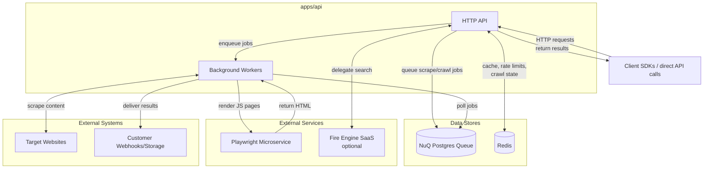

# Self-hosting Firecrawl

#### Contributor?

Welcome to [Firecrawl](https://firecrawl.dev) 🔥! Here are some instructions on how to get the project locally so you can run it on your own and contribute.

If you're contributing, note that the process is similar to other open-source repos, i.e., fork Firecrawl, make changes, run tests, PR.

If you have any questions or would like help getting on board, join our Discord community [here](https://discord.gg/gSmWdAkdwd) for more information or submit an issue on Github [here](https://github.com/firecrawl/firecrawl/issues/new/choose)!

## System overview

### Architecture at a glance



Firecrawl is composed of several services and supporting packages:

| Component | Location | Purpose | Why it matters |
| --- | --- | --- | --- |
| **API & worker runtime** | `apps/api` | Express API, background workers, billing, rate limiting, admin UI | This container is the brain of the system. It exposes the REST API, normalises requests, enqueues jobs, and hosts workers that actually crawl/scrape and trigger webhooks. |
| **Playwright microservice** | `apps/playwright-service-ts` | Headless Chromium renderer with a thin HTTP wrapper | Handles JS-heavy pages or sites that require full-browser execution. API workers call it when they detect dynamic content. |
| **NuQ queue database** | `apps/nuq-postgres` | Postgres schema + pg_cron jobs backing the "NuQ" queue | Provides durable job storage so scrape/crawl work survives container restarts. Workers poll it for new work and mark results. |
| **Redis** | `apps/redis` (or external) | Backing store for BullMQ, rate limits, crawl state, caching | Powers concurrency control, crawl bookkeeping, and the Bull queue used for billing & notifications. |
| **External search providers** | `FIRE_ENGINE_BETA_URL`, SearXNG, Serper, SearchAPI | Optional upstreams for `/search` and `/map` endpoints | Firecrawl can call Mendable's Fire Engine, a self-hosted SearXNG, or other APIs. If none are configured the API falls back to first-party scraping. |
| **SDKs** | `apps/js-sdk`, `apps/python-sdk`, `apps/rust-sdk` | Language clients mirroring the REST interface | Useful for local development and testing your self-hosted deployment. |
| **UX / docs** | `apps/ui`, `apps/www`, `img/` | Cloud dashboard and marketing docs | Not required for self-hosting but helpful to understand the product's UX goals. |

### Key request flows

**Search flow**

1. Client calls `/v2/search`.
2. API optionally delegates to Fire Engine or another configured search provider, then normalises and ranks the results.
3. If the request includes `scrapeOptions`, the API enqueues follow-up scrape jobs in NuQ so workers can enrich each result (e.g., convert to Markdown) before returning.

**Scrape / crawl flow**

1. Client calls `/v1` or `/v2` `scrape`, `crawl`, `map`, or `extract`.
2. API validates options, manages per-team concurrency in Redis, and stores the job in NuQ.
3. Workers pull jobs, decide between lightweight HTTP fetches or Playwright renders, apply parsers (Markdown, JSON, PDF, etc.), and stream progress back via Redis/GCS when enabled.
4. Results are written to cache, billed via the BullMQ queue, and optionally pushed to customer webhooks or Supabase/GCS storage.

### Optional & supporting subsystems

- **Supabase** – provides authentication, API key storage, and analytics when `USE_DB_AUTHENTICATION=true` (cloud-only today for write access).
- **Google Cloud Storage (GCS)** – used to archive scrape payloads when `GCS_FIRE_ENGINE_BUCKET_NAME` is set.
- **OpenTelemetry / PostHog / Slack** – observability hooks (`POSTHOG_*`, `SLACK_WEBHOOK_URL`) that the API can publish to if configured.
- **Proxy layer** – configure `PROXY_SERVER`, `PROXY_USERNAME`, `PROXY_PASSWORD` to route all outbound scraping traffic through your proxy provider.
- **Fire Engine** – Mendable's managed anti-bot and search infrastructure. Self-hosted deployments typically operate without it; leaving `FIRE_ENGINE_BETA_URL` unset simply disables those integrations.

## Why self-host?

Self-hosting Firecrawl is particularly beneficial for organizations with stringent security policies that require data to remain within controlled environments. Here are some key reasons to consider self-hosting:

- **Enhanced Security and Compliance:** By self-hosting, you ensure that all data handling and processing complies with internal and external regulations, keeping sensitive information within your secure infrastructure. Note that Firecrawl is a Mendable product and relies on SOC2 Type2 certification, which means that the platform adheres to high industry standards for managing data security.
- **Customizable Services:** Self-hosting allows you to tailor the services, such as the Playwright service, to meet specific needs or handle particular use cases that may not be supported by the standard cloud offering.
- **Learning and Community Contribution:** By setting up and maintaining your own instance, you gain a deeper understanding of how Firecrawl works, which can also lead to more meaningful contributions to the project.

### Considerations

However, there are some limitations and additional responsibilities to be aware of:

1. **Limited Access to Fire-engine:** Currently, self-hosted instances of Firecrawl do not have access to Fire-engine, which includes advanced features for handling IP blocks, robot detection mechanisms, and more. This means that while you can manage basic scraping tasks, more complex scenarios might require additional configuration or might not be supported.
2. **Manual Configuration Required:** If you need to use scraping methods beyond the basic fetch and Playwright options, you will need to manually configure these in the `.env` file. This requires a deeper understanding of the technologies and might involve more setup time.

Self-hosting Firecrawl is ideal for those who need full control over their scraping and data processing environments but comes with the trade-off of additional maintenance and configuration efforts.

## Steps

1. First, start by installing the dependencies

- Docker [instructions](https://docs.docker.com/get-docker/)

2. Set environment variables

Create an `.env` in the root directory using the template below.

`.env:`

```
# ===== Required ENVS ======
PORT=3002
HOST=0.0.0.0

# Note: PORT is used by both the main API server and worker liveness check endpoint

# To turn on DB authentication, you need to set up Supabase.
USE_DB_AUTHENTICATION=false

# ===== Optional ENVS ======

## === AI features (JSON format on scrape, /extract API) ===
# Provide your OpenAI API key here to enable AI features
# OPENAI_API_KEY=

# Experimental: Use Ollama
# OLLAMA_BASE_URL=http://localhost:11434/api
# MODEL_NAME=deepseek-r1:7b
# MODEL_EMBEDDING_NAME=nomic-embed-text

# Experimental: Use any OpenAI-compatible API
# OPENAI_BASE_URL=https://example.com/v1
# OPENAI_API_KEY=

## === Proxy ===
# PROXY_SERVER can be a full URL (e.g. http://0.1.2.3:1234) or just an IP and port combo (e.g. 0.1.2.3:1234)
# Do not uncomment PROXY_USERNAME and PROXY_PASSWORD if your proxy is unauthenticated
# PROXY_SERVER=
# PROXY_USERNAME=
# PROXY_PASSWORD=

## === /search API ===
# By default, the /search API will use Google search.

# You can specify a SearXNG server with the JSON format enabled, if you'd like to use that instead of direct Google.
# You can also customize the engines and categories parameters, but the defaults should also work just fine.
# SEARXNG_ENDPOINT=http://your.searxng.server
# SEARXNG_ENGINES=
# SEARXNG_CATEGORIES=

## === Other ===

# Supabase Setup (used to support DB authentication, advanced logging, etc.)
# SUPABASE_ANON_TOKEN=
# SUPABASE_URL=
# SUPABASE_SERVICE_TOKEN=

# Use if you've set up authentication and want to test with a real API key
# TEST_API_KEY=

# This key lets you access the queue admin panel. Change this if your deployment is publicly accessible.
BULL_AUTH_KEY=CHANGEME

# This is now autoconfigured by the docker-compose.yaml. You shouldn't need to set it.
# PLAYWRIGHT_MICROSERVICE_URL=http://playwright-service:3000/scrape
# REDIS_URL=redis://redis:6379
# REDIS_RATE_LIMIT_URL=redis://redis:6379

# Set if you have a llamaparse key you'd like to use to parse pdfs
# LLAMAPARSE_API_KEY=

# Set if you'd like to send server health status messages to Slack
# SLACK_WEBHOOK_URL=

# Set if you'd like to send posthog events like job logs
# POSTHOG_API_KEY=
# POSTHOG_HOST=

## === System Resource Configuration ===
# Maximum CPU usage threshold (0.0-1.0). Worker will reject new jobs when CPU usage exceeds this value.
# Default: 0.8 (80%)
# MAX_CPU=0.8

# Maximum RAM usage threshold (0.0-1.0). Worker will reject new jobs when memory usage exceeds this value.
# Default: 0.8 (80%)
# MAX_RAM=0.8
```

3. Build and run the Docker containers:

    ```bash
    docker compose build
    docker compose up
    ```

    If you encounter an error, make sure you're using `docker compose` and not `docker-compose`.

    This will run a local instance of Firecrawl which can be accessed at `http://localhost:3002`.

    You should be able to see the Bull Queue Manager UI on `http://localhost:3002/admin/CHANGEME/queues`.

5. *(Optional)* Test the API

If you’d like to test the crawl endpoint, you can run this:

  ```bash
  curl -X POST http://localhost:3002/v1/crawl \
      -H 'Content-Type: application/json' \
      -d '{
        "url": "https://firecrawl.dev"
      }'
  ```

## Troubleshooting

This section provides solutions to common issues you might encounter while setting up or running your self-hosted instance of Firecrawl.

### API Keys for SDK Usage

**Note:** When using Firecrawl SDKs with a self-hosted instance, API keys are optional. API keys are only required when connecting to the cloud service (api.firecrawl.dev).

### Supabase client is not configured

**Symptom:**

```bash
[YYYY-MM-DDTHH:MM:SS.SSSz]ERROR - Attempted to access Supabase client when it's not configured.
[YYYY-MM-DDTHH:MM:SS.SSSz]ERROR - Error inserting scrape event: Error: Supabase client is not configured.
```

**Explanation:**
This error occurs because the Supabase client setup is not completed. You should be able to scrape and crawl with no problems. Right now it's not possible to configure Supabase in self-hosted instances.

### You're bypassing authentication

**Symptom:**

```bash
[YYYY-MM-DDTHH:MM:SS.SSSz]WARN - You're bypassing authentication
```

**Explanation:**
This error occurs because the Supabase client setup is not completed. You should be able to scrape and crawl with no problems. Right now it's not possible to configure Supabase in self-hosted instances.

### Docker containers fail to start

**Symptom:**
Docker containers exit unexpectedly or fail to start.

**Solution:**
Check the Docker logs for any error messages using the command:

```bash
docker logs [container_name]
```

- Ensure all required environment variables are set correctly in the .env file.
- Verify that all Docker services defined in docker-compose.yml are correctly configured and the necessary images are available.

### Connection issues with Redis

**Symptom:**
Errors related to connecting to Redis, such as timeouts or "Connection refused".

**Solution:**

- Ensure that the Redis service is up and running in your Docker environment.
- Verify that the REDIS_URL and REDIS_RATE_LIMIT_URL in your .env file point to the correct Redis instance, ensure that it points to the same URL in the `docker-compose.yaml` file (`redis://redis:6379`)
- Check network settings and firewall rules that may block the connection to the Redis port.

### API endpoint does not respond

**Symptom:**
API requests to the Firecrawl instance timeout or return no response.

**Solution:**

- Ensure that the Firecrawl service is running by checking the Docker container status.
- Verify that the PORT and HOST settings in your .env file are correct and that no other service is using the same port.
- Check the network configuration to ensure that the host is accessible from the client making the API request.

By addressing these common issues, you can ensure a smoother setup and operation of your self-hosted Firecrawl instance.

## Install Firecrawl on a Kubernetes Cluster (Simple Version)

Read the [examples/kubernetes/cluster-install/README.md](https://github.com/firecrawl/firecrawl/blob/main/examples/kubernetes/cluster-install/README.md) for instructions on how to install Firecrawl on a Kubernetes Cluster.

## Install Firecrawl on a Kubernetes Cluster with Helm

Read the [examples/kubernetes/firecrawl-helm/README.md](https://github.com/firecrawl/firecrawl/blob/main/examples/kubernetes/firecrawl-helm/README.md) for instructions on how to install Firecrawl on a Kubernetes Cluster with Helm.
